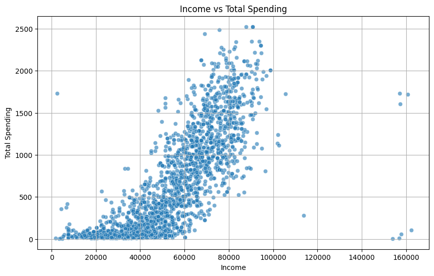
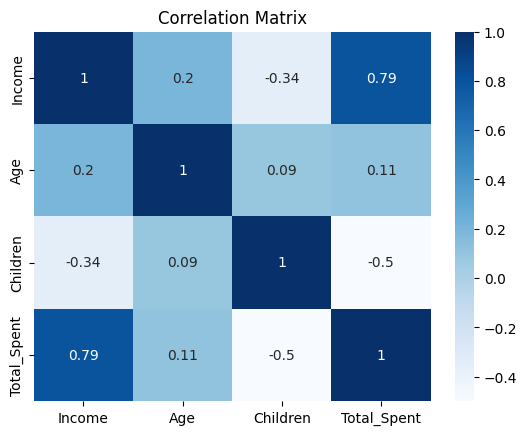
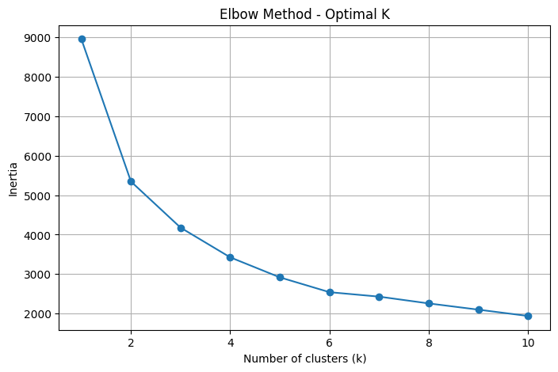
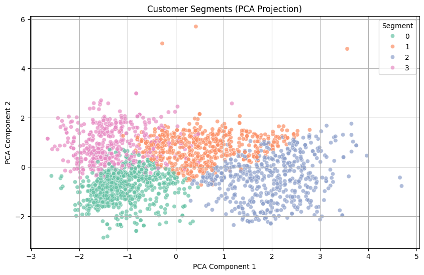

# Customer Personality Analysis – Data Cleaning & Segmentation Project

This project showcases a full data wrangling and segmentation workflow using the **Customer Personality Analysis** dataset. The goal is to prepare the data, explore relationships, and apply clustering techniques to uncover distinct customer groups.

---

## 📁 Dataset Overview

The dataset contains demographic, lifestyle, and purchase behavior information for 2,240 customers from a multi-channel marketing campaign.

### Key Variables:
- **Demographics:** Age, Income, Marital Status, Education, Number of Children
- **Spending:** Wine, Meat, Gold, etc.
- **Engagement:** Campaign responses, website visits

---

## 🔧 Tools Used

- **Python 3**
- **pandas / numpy** for data manipulation
- **matplotlib / seaborn** for data visualization
- **scikit-learn** for scaling, clustering (KMeans), and PCA

---

## 🔍 Workflow Summary

### 1. Data Cleaning

- Converted date columns (`Dt_Customer`) to datetime
- Handled missing values in `Income` with **median imputation**
- Removed extreme outlier with `Income = 666,666`
- Standardized categorical values (e.g., merged `Alone`, `Absurd`, `YOLO` under valid categories)

### 2. Feature Engineering

- Created `Age`, `Children`, `Customer_Tenure_Years`, and `Total_Spent` features
- Standardized numerical features for modeling

### 3. Exploratory Data Analysis

- Analyzed income distribution and total spending behavior
- Identified positive correlation between income and spending
- Detected inverse relationship between number of children and spending





### 4. Clustering Analysis (KMeans)

- Applied Elbow Method to select **k = 4**
- Performed clustering using KMeans
- Visualized clusters with PCA




### 5. Segment Insights

| Segment | Income (€) | Spending (€) | Age | Children | Interpretation |
|---------|------------|---------------|-----|----------|----------------|
| 0       | ~32,500    | ~150          | 48  | 0.85     | Low income & low spending |
| 1       | ~59,500    | ~727          | 67  | 0.77     | Moderate income, older age |
| 2       | ~77,200    | ~1,435        | 53  | 0.27     | High income, high spending |
| 3       | ~43,800    | ~215          | 60  | 2.12     | Budget-constrained families |

---

## 📘 File Structure

```
.
├── Customer_Personality_Analysis.ipynb
├── README.md
├── income_distribution.png
├── income_vs_total_spending.png
├── correlation_matrix.png
├── kmeans_elbow_method.png
└── customer_segments.png
```

---

## ✅ What I Learned

- How to clean, preprocess, and engineer real-world customer data
- How to identify patterns using visualizations and correlations
- How to apply clustering and interpret segments in a business context

This project reflects my ability to go from messy raw data to actionable business insights using Python.

---

## 📎 Author

Christos Papakostas
