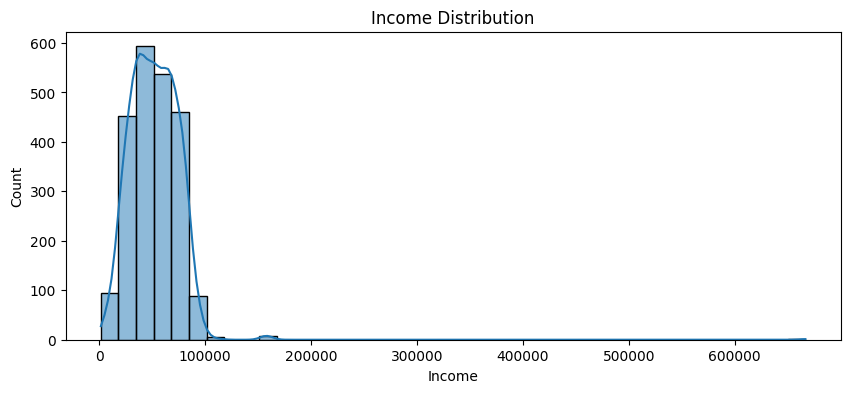

# Customer Personality Analysis – Data Cleaning & Segmentation Project

This project showcases a full data wrangling and segmentation workflow using the **Customer Personality Analysis** dataset. The goal is to prepare the data, explore relationships, and apply clustering techniques to uncover distinct customer groups.

---

## 📁 Dataset Overview

The dataset contains demographic, lifestyle, and purchase behavior information for 2,240 customers from a multi-channel marketing campaign.

### Key Variables:
- **Demographics:** Age, Income, Marital Status, Education, Number of Children
- **Spending:** Wine, Meat, Gold, etc.
- **Engagement:** Campaign responses, website visits

---

## 🔧 Tools Used

- **Python 3**
- **pandas and numpy** for data manipulation
- **matplotlib and seaborn** for data visualization
- **scikit-learn** for scaling, clustering (KMeans), and PCA

---

## 🔍 Workflow Summary

### 1. Data Cleaning

**Missing Values:**
- The `Income` column had 24 missing values. Since this was only about 1% of the dataset, and the income distribution was reasonably normal (mean ≈ median), I chose to fill them using the **median imputation** strategy. This preserved data volume without introducing skew.

**Outliers:**
- I detected one extreme outlier (`Income = 666,666`) far beyond the typical distribution. This value was likely erroneous or a placeholder. Removing it avoided distortion of mean-based analyses and scaling operations later in the pipeline.

**Label Cleaning:**
- Categorical anomalies such as 'YOLO', 'Absurd', and 'Alone' in `Marital_Status` were consolidated into a new label (`Other`) or mapped into standard values (e.g. 'Alone' → 'Single'). Similarly, '2n Cycle' in `Education` was renamed to 'Undergraduate'.

- Converted date columns (`Dt_Customer`) to datetime
- Handled missing values in `Income` with **median imputation**
- Removed extreme outlier with `Income = 666,666`
- Standardized categorical values (e.g., merged `Alone`, `Absurd`, `YOLO` under valid categories)

### 2. Feature Engineering

- Created `Age`, `Children`, `Customer_Tenure_Years`, and `Total_Spent` features
- Standardized numerical features for modeling

### 3. Exploratory Data Analysis

**Goal:** Understand the relationships between key variables such as income, spending, age, and number of children. This helps define potential customer behavior patterns and informs our clustering strategy.

- **Income Distribution:** Most customers earn between €30,000 and €70,000. A single extreme outlier with income of €666,666 was removed.
- **Spending Behavior:** There is a strong positive correlation between income and total spending (correlation = 0.79). Customers with higher income tend to spend significantly more.
- **Children Impact:** Customers with more children tend to spend less, showing a moderate negative correlation (−0.50). This likely reflects more budget-conscious behavior.
- **Age:** Age has a weak correlation with income and spending, but older customers tend to spend slightly more on average.


- Analyzed income distribution and total spending behavior
- Identified a positive correlation between income and spending
- Detected an inverse relationship between the number of children and spending




### 4. Clustering Analysis (KMeans)

**Why Clustering?**
To discover hidden segments of customers with similar characteristics and behaviors. Clustering allows for customer targeting, campaign personalization, and strategic decision-making without predefined labels.

**Feature Selection:**
- I used standardized values of `Income`, `Total_Spent`, `Age`, and `Children` — key numeric drivers of customer value and behavior.

**Choosing the Number of Clusters (k):**
- The **Elbow Method** was used to determine the optimal number of clusters. I plotted the inertia (within-cluster sum of squares) for values of k from 1 to 10.
- The curve showed a distinct 'elbow' at `k = 4`, where adding more clusters had diminishing returns in terms of explained variance.


**Modeling:**
- I applied **KMeans clustering** with `k=4` and assigned each customer to one of four segments.
- To visualize the clustering results, I used **Principal Component Analysis (PCA)** to reduce the feature space to 2D and plotted the segments.


- Applied Elbow Method to select **k = 4**
- Performed clustering using KMeans
- Visualized clusters with PCA


### 5. Segment Insights

**Goal:** Identify meaningful customer groups to enable targeted marketing strategies. Clustering was based on Income, Total Spending, Age, and Number of Children.

**Segments Identified:**
- **Segment 0 – Budget-Conscious Younger Families:** Customers with relatively low income (~€32k), moderate age (~48), and nearly 1 child. Spending is very low (~€150).
- **Segment 1 – Mid-Income Older Customers:** These customers (~€59k income, ~67 years old) spend a moderate amount (~€727). Possibly stable, retired customers with predictable behavior.
- **Segment 2 – Affluent High Spenders:** High income (~€77k) and very high spending (~€1435), with few children. These are the most valuable customers.
- **Segment 3 – Large Families with Low Spending:** Mid-to-low income (~€43k) and the highest number of children (~2.1). Spending is low (~€215), possibly due to financial constraints.

The PCA visualization shows clear separation between these groups, validating the clustering process.

| Segment | Income (€) | Spending (€) | Age | Children | Interpretation |
|---------|------------|---------------|-----|----------|----------------|
| 0       | ~32,500    | ~150          | 48  | 0.85     | Low income & low spending |
| 1       | ~59,500    | ~727          | 67  | 0.77     | Moderate income, older age |
| 2       | ~77,200    | ~1,435        | 53  | 0.27     | High income, high spending |
| 3       | ~43,800    | ~215          | 60  | 2.12     | Budget-constrained families |

---

## 📘 File Structure

```
.
├── Customer_Personality_Analysis.ipynb
├── README.md
├── income_distribution.png
├── income_vs_total_spending.png
├── correlation_matrix.png
├── kmeans_elbow_method.png
└── customer_segments.png
```

---

## ✅ What I Learned

- How to clean, preprocess, and engineer real-world customer data
- How to identify patterns using visualizations and correlations
- How to apply clustering and interpret segments in a business context

This project reflects my ability to go from messy raw data to actionable business insights using Python.

---

## 📎 Author

Christos Papakostas
